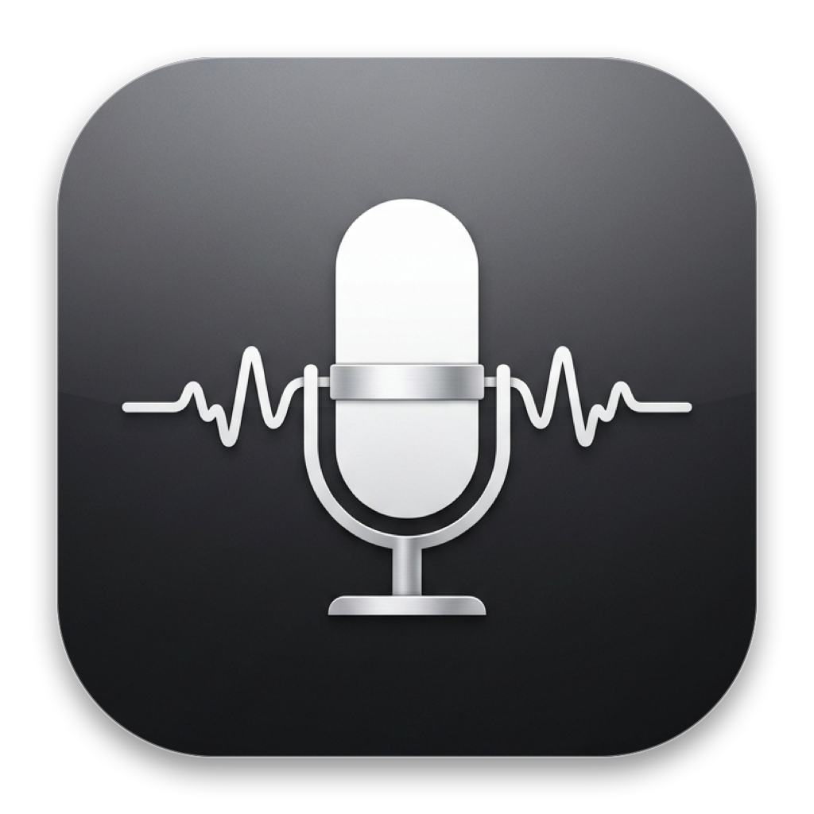

<div align="center">



# Scribe

**Fast, private voice dictation for macOS that works anywhere you can type.**

[](LICENSE) [](https://www.apple.com/macos/) [](https://swift.org) [](https://www.apple.com/mac/)

Press `⌥S`, talk, press it again. Your words land directly in whatever text field you were using. No account, no subscription, no audio leaving your machine.

[**Download Scribe (.dmg)**](https://github.com/bledny1099/Scribe/releases/latest/download/Scribe.dmg) · [**Releases**](https://github.com/bledny1099/Scribe/releases) · [**Report Issue**](https://github.com/bledny1099/Scribe/issues)

</div>

---

## What it does

Scribe sits in your menu bar and waits for a global shortcut. Trigger it anywhere (`⌥S`), and a translucent Liquid Glass HUD appears near the bottom of your screen with an audio-reactive waveform and a running live preview of what you are saying. 

Release or press the shortcut again, and the transcribed text is automatically pasted into the active application you were already working in (Xcode, Slack, VS Code, Telegram, Notes, terminal, or browser). Every transcription is stored locally in your searchable history, so you can revisit or copy past dictations at any time.

## Install

### Direct download

Download the latest **[Scribe.dmg](https://github.com/bledny1099/Scribe/releases/latest/download/Scribe.dmg)** from the Releases page, open the disk image, and drag **Scribe** into your **Applications** folder.

#### First-Launch Note (macOS Gatekeeper)

Because Scribe is a free open-source application distributed outside the Mac App Store without a paid Apple Developer certificate, macOS may flag it on first launch:

- **Quickest**: Right-click (or Control-click) `Scribe.app` in `/Applications` → click **Open** → click **Open** in the confirmation dialog.
- **System Settings**: Go to **System Settings** → **Privacy & Security** → scroll down to Security → click **Open Anyway**.
- **Terminal**: Run `xattr -cr /Applications/Scribe.app`.

### Building from source

Requirements:
- macOS 14.0 (Sonoma) or newer
- Xcode 15+ / 16+
- Apple Silicon (M1/M2/M3/M4) recommended

```bash
# Clone the repository
git clone https://github.com/bledny1099/Scribe.git
cd Scribe

# Build Release DMG
./scripts/build_dmg.sh
```

The compiled application and installer disk image will be created at `dist/Scribe.dmg`.

---

## Why Scribe

There are plenty of voice-to-text tools for macOS, but most come with significant trade-offs:

- **Cloud subscriptions & privacy risks**: Many services stream your raw audio or keystrokes to third-party servers.
- **Heavy web wrappers**: Electron and browser-based apps consume hundreds of megabytes of RAM while idling in the background.
- **Slow transcription**: Generic tools lack hardware optimization for Apple Silicon Neural Engine cores.

Scribe was built with a different architecture:

1. **Hybrid Aether Engine**: Combines Apple's on-device Speech framework for zero-latency live visual feedback with WhisperKit compiled for Apple Neural Engine (ANE) to deliver studio-quality punctuation, formatting, and capitalization.
2. **Zero-Download Mode (Aether Instant)**: If you prefer not to download external models (~0 MB download, ~0 MB disk usage), switch the engine to **Aether Instant** in Settings to run purely on macOS's built-in native Apple Speech engine with instant speed and minimal CPU usage.
3. **Context Biasing**: Intelligently identifies the active application and biases recognition toward technical terminology, developer jargon, and custom dictionary words.
4. **100% On-Device & Open Source**: Native Swift, lightweight memory footprint, and zero analytics or telemetry.

---

## Features

- **Global Hotkey (`⌥S`)**: Rebindable trigger with support for push-to-talk and single-key shortcuts.
- **Universal Auto-Paste**: Direct text insertion into any focused input field.
- **Zero-Download Mode**: Switch to *Aether Instant* for instant dictation using macOS's built-in speech engine with 0 MB model download.
- **50+ Languages**: Full multilingual speech recognition with automatic language detection.
- **Liquid Glass HUD**: 5 audio-reactive visualizer modes (*Waveform*, *Classic*, *Minimal*, *ECG*, *Orb*) with customizable color themes.
- **Searchable Local History**: Full-text search and one-click copy across past recordings.
- **Direct Notes Export**: Optional instant capture directly into Apple Notes, Obsidian, or Notion.
- **Zero Network Dependency**: Runs completely offline with local Whisper models (Small, Large V3 Turbo, Base).

---

## Requirements

| Component | Minimum Specification |
| **OS** | macOS 14.0 (Sonoma) or later |
| **Hardware** | Apple Silicon (M1, M2, M3, M4) or Intel 64-bit |
| **Permissions** | Microphone (audio capture), Accessibility (auto-paste) |
| **Storage** | ~500 MB for recommended local Whisper models |

---

## License

This project is licensed under the [GNU General Public License v3.0 (GPL-3.0)](LICENSE).
